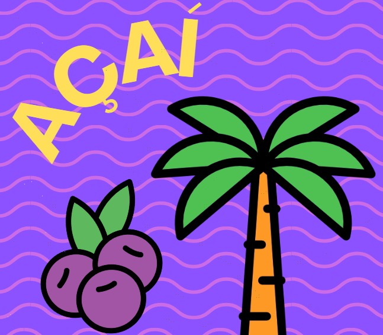

# Projeto Acaíteria Web App 

**Projeto desenvolvido para a disciplina de programação web, com o intuito de criar uma aplicação de serviço para pedidos online de uma açaíteria.**




## Índice

- [Como rodar este projeto?](#-Como-rodar-este-projeto?)
- [Tecnologias utilizadas](#-Tecnologias-utilizadas)
- [Desenvolvimento](#-Desenvolvimento)

## Como rodar este projeto?

Para o funcionamento do programa, vamos fazer as seguintes instalações

- [JDK 21: Utilitários para o funcionamento do projeto java](https://www.oracle.com/java/technologies/downloads/)
- [Apache Maven 3.9.6: Ferramenta de compilação para nosso projeto ](https://maven.apache.org/download.cgi)
- [Uma IDE para desenvolvimento: IntelliJ IDEA](https://www.jetbrains.com/idea/download/?section=windows)
 
Outras implementações já estão presentes no arquivo de dependêcias do projeto.

## Tecnologias utilizadas

Aqui segue uma lista demonstrando as principais tecnologias presentes neste projeto até então:


## Desenvolvimento

Para começar o seu desenvolvimento, basta clonar este repositório para seu ambiente de preferência:

```shell
cd "Caminho/do/seu/ambiente"
git clone https://github.com/DimitriLouback/AcaiteriaWebApp
```


